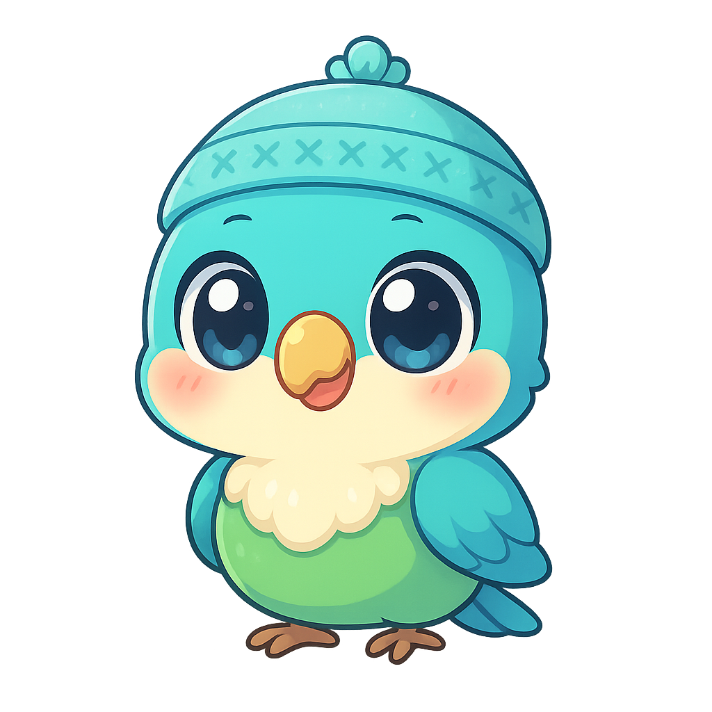
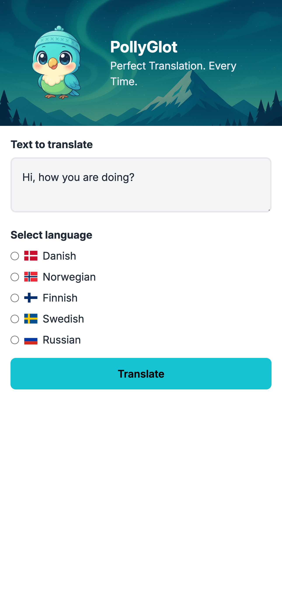

<div align="center">
  
</div>

# PollyGlot

[](https://app.netlify.com/sites/nordic-pollyglot/deploys)

PollyGlot is a solo project for the `Intro to AI Engineering` chapter from **"The AI Engineer Path"** on Scrimba. Made with Remix. Deployed on Netlify.

## Development

### API Key Setup

This application requires an OpenAI API key to function properly. Follow these steps to set it up:

1. **Get an API Key**:
   - Create an account at [OpenAI's platform](https://platform.openai.com/)
   - Navigate to the [API Keys section](https://platform.openai.com/api-keys)
   - Create a new secret key
   - Copy the key (note that you won't be able to see it again after this)

2. **Set up the API Key**:

   **Option 1**: Using a `.env` file:
   ```sh
   echo "OPENAI_API_KEY=your-api-key-here" > .env
   ```


### Run the dev server:

```shellscript
npm run dev
```

## Deployment

First, build your app for production:

```sh
npm run build
```

Then run the app in production mode:

```sh
npm start
```

Now you'll need to pick a host to deploy it to.

### DIY

If you're familiar with deploying Node applications, the built-in Remix app server is production-ready.

Make sure to deploy the output of `npm run build`

- `build/server`
- `build/client`

## Screens
<div align="center" style="">
  
</div>

## Useful links
- 📖 [Remix docs](https://remix.run/docs)